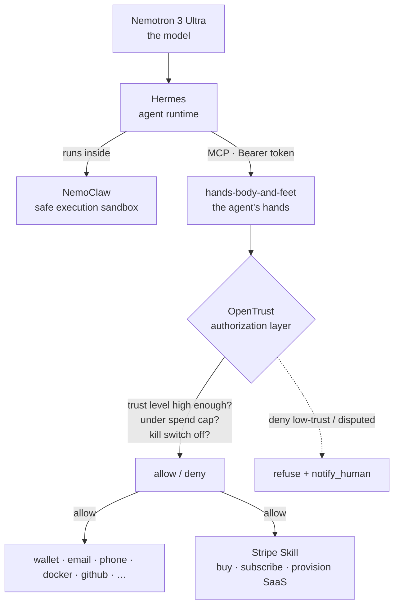

# Recipe: A Hermes agent with real-world hands — *safely*

Run a [Hermes](https://nousresearch.com) agent on **NVIDIA Nemotron 3 Ultra**, sandboxed by **NVIDIA NemoClaw**, with real-world capabilities from OpenTrust's [`hands-body-and-feet`](../packages/hands-body-and-feet/) MCP server — where **every action is gated by passport trust level, spend caps, and a kill switch.**

> Built for the Hermes Agent Accelerated Business Hackathon (NVIDIA × Stripe × Nous Research).
> Anything marked `<…>` or `# TODO` is where you plug in the hackathon's exact Hermes / NemoClaw / Nemotron / Stripe Skill values. Everything in the OpenTrust / `hands-body-and-feet` blocks is real.

---

## How the layers fit

Two different safety jobs, two complementary layers — you want both:

- **NemoClaw** sandboxes *where the agent runs* — it contains the process and its system access.
- **OpenTrust** governs *what the agent is allowed to do* — it authorizes each tool call by trust level and spend policy.



The rule, everywhere: **the rail moves the money; OpenTrust says yes or no.**

---

## Prerequisites

- Node.js 20+
- An OpenTrust agent passport token (`OPENTRUST_PASSPORT_TOKEN`) — or run with the local default identity for testing
- NVIDIA access for Nemotron 3 Ultra and NemoClaw  `# TODO: hackathon-provided keys/endpoints`
- Hermes access  `# TODO`
- A Stripe **test-mode** key, or the Hermes **Stripe Skill**  `# TODO`

---

## Step 1 — Start the hands (`hands-body-and-feet` MCP server)

**stdio (simplest — any harness, zero config):**

```bash
OPENTRUST_PASSPORT_TOKEN=<your-passport-token> \
  npx -y @infinitestudios/hands-body-and-feet stdio
```

**or HTTP (multi-tenant, per-request passport auth):**

```bash
npx @infinitestudios/hands-body-and-feet init     # interactive config
npx @infinitestudios/hands-body-and-feet serve     # http://localhost:3847/mcp
```

Identity defaults to a local **L3** agent; set `OPENTRUST_PASSPORT_TOKEN` (a real passport) or `OPENTRUST_AGENT_ID` / `OPENTRUST_TRUST_STATUS` to customize. Trust levels, spend caps, and the kill switch are enforced per tool call regardless.

---

## Step 2 — Point Hermes at Nemotron 3 Ultra

```bash
# TODO: replace with the hackathon's actual Nemotron endpoint + model id
export NVIDIA_API_KEY=<your-nvidia-key>
export HERMES_MODEL=nemotron-3-ultra
export HERMES_MODEL_BASE_URL=<nvidia-nim-or-api-endpoint>
```

---

## Step 3 — Run the agent inside NemoClaw

NemoClaw is the sandbox; OpenTrust is the authority layer. Run Hermes **under** NemoClaw so the *process* is contained, while OpenTrust governs the *tools*:

```bash
# Illustrative — replace with the actual NemoClaw invocation from the hackathon docs
nemoclaw run \
  --policy ./nemoclaw.policy.yaml \
  -- hermes serve --model "$HERMES_MODEL"
```

---

## Step 4 — Connect Hermes to the MCP server

Add `hands-body-and-feet` to the agent's MCP config:

```jsonc
{ "mcpServers": { "hands-body-and-feet": {
  "command": "npx",
  "args": ["-y", "@infinitestudios/hands-body-and-feet", "stdio"],
  "env": { "OPENTRUST_PASSPORT_TOKEN": "<your-passport-token>" }
}}}
```

For the HTTP transport instead: `POST http://localhost:3847/mcp` with `Authorization: Bearer <passport token>`.

---

## Step 5 — Set the guardrails (do this *before* you unleash it)

```bash
hands-body-and-feet status      # wallets, spend policy, kill-switch state, active deps
hands-body-and-feet pause       # passphrase-protected — halts ALL tool calls (503 PAUSED)
hands-body-and-feet resume      # re-validates passports vs the revocation list, then resumes
```

Recommended starting policy: a low `max_per_call`, a conservative `daily_cap`, and a minimum trust level for any money-moving tool. L4 tools (wallets, cards, Docker) require elevated trust by design — spend is rejected **pre-broadcast**, never silently downgraded.

---

## Step 6 — Payments: Stripe (first-class) *and* USDC

OpenTrust is rail-agnostic. Your Hermes agent can pay with the **Stripe Skill** (fiat) or **USDC on Base** — and OpenTrust authorizes either the same way: it checks the target tool's trust level and your spend caps *before* the money moves.

- **Stripe** — the agent calls its Stripe Skill (buy / subscribe / provision SaaS). A tool that accepts Stripe declares `payment_config.type: "stripe"` in its passport (see [`stripe-paid-tool-passport.json`](../passport-schema/examples/stripe-paid-tool-passport.json)).
- **USDC** — `pay_with_usdc` (Base L2), gated identically.

**The rail moves the money; OpenTrust says yes or no.**

---

## Worked example — trust-gated autonomous spend (the demo)

The scenario that shows why this layer has to exist:

1. The Hermes agent gets a task and a budget — e.g. *"subscribe to a market-data tool, pull quotes, deliver a report."*
2. It finds two candidate tools in the registry and checks each passport:
   - `opentrust inspect <tool-a>` → `disputed` / low trust → **OpenTrust refuses the payment** and fires `notify_human`.
   - `opentrust inspect <tool-b>` → `security_checked` → allowed.
3. It pays **tool-b via Stripe** (or USDC) — under the `max_per_call` cap — provisions the SaaS, and does the work.
4. The operator runs `hands-body-and-feet pause` live → the next tool call returns `503 PAUSED`. Nothing moves.

That's *earn / spend / operate* — **safely**. The agent can't be tricked into paying a sketchy tool, can't exceed its budget, and can be stopped instantly.

---

## Safety checklist

- ✅ **Trust-enforcement matrix** — every tool requires a minimum passport trust level
- ✅ **Spend caps** — `max_per_call`, `daily_cap`, `gas_reserve_amount`; rejected pre-broadcast
- ✅ **Kill switch** — `pause` / `resume`, passphrase-protected, propagates across instances
- ✅ **Fail-closed secrets** — if the OpenTrust registry is unreachable, the server refuses to start
- ✅ **EIP-712 guard** — first use of a new typed-data domain is rejected until you allowlist it
- ✅ **Revocation re-check on resume**

---

*The only things to fill in are the `<…>` / `# TODO` placeholders for the hackathon's exact Hermes / NemoClaw / Nemotron / Stripe Skill values — the OpenTrust pieces are real commands you can run today.*
